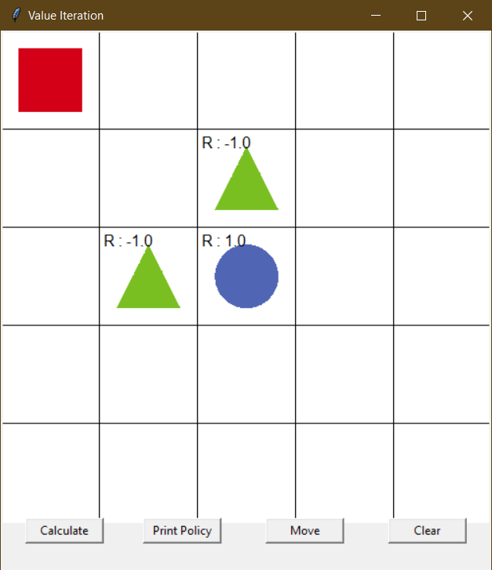
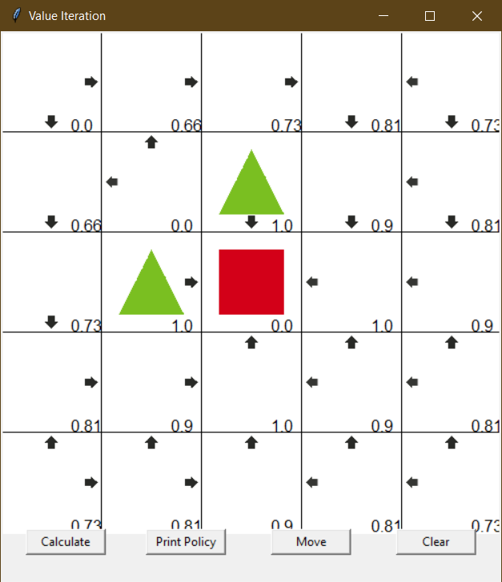
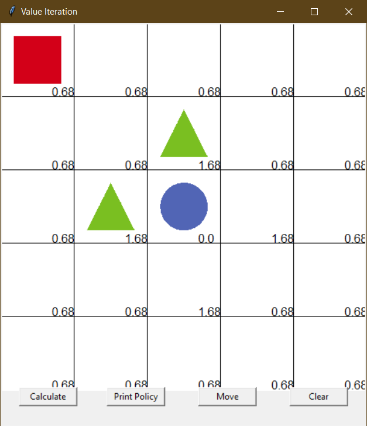
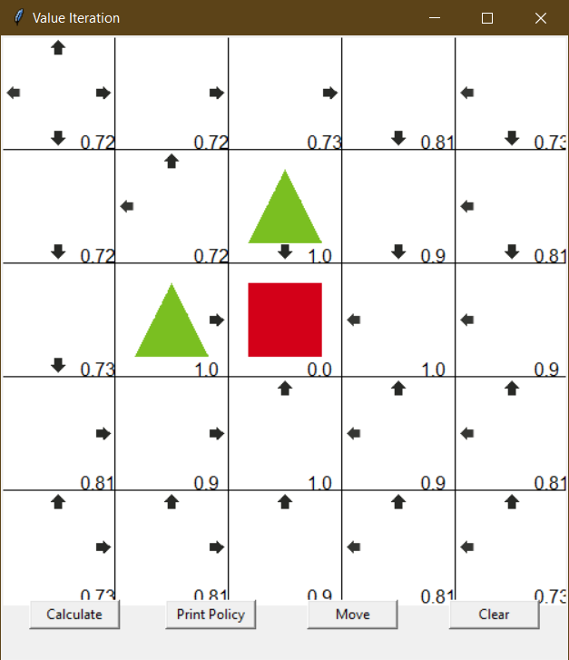
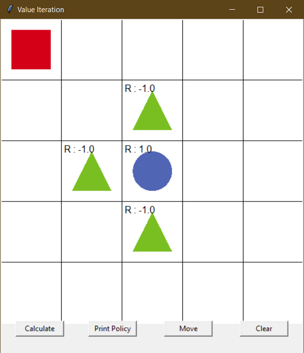
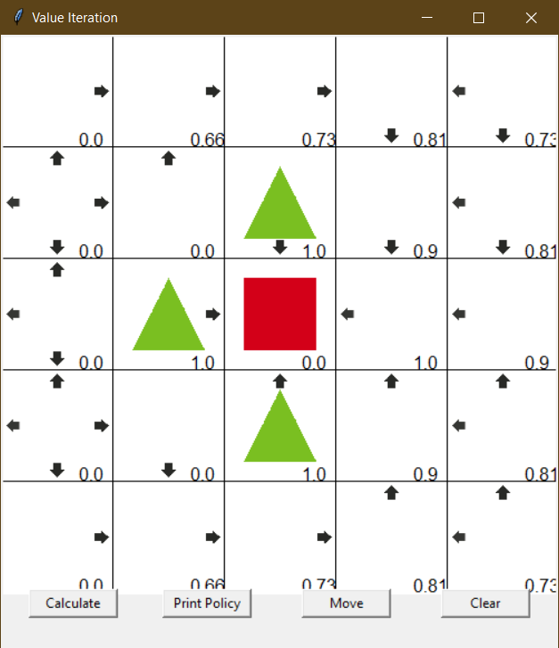

# Grid world with value iteration

1. First Running - set an environment

<p align="center"></p>

When we running the program for the first time, we will see interface like above image. Reward `1.0` is given to the blue circle as final destination. Two green triangles is placed near blue circle as penalty with given reward `-1.0`. The empty grid will be given reward `0` for initial value.

The  main program loads environment from environment.py and apply value iteration on that environment.

2. Value Iteration

Action list get from q value of each possible actions in grid world with this function: 

```python
value = (reward + self.discount_factor * next_value)
```

action that has maximum q value will be added to action list through this function: 

```python
if value > max_value:
    action_list.clear()
    action_list.append(action)
    max_value = value
elif value == max_value:
    action_list.append(action)
```

3. Training

<p align="center"></p>

We manage get optimal solution with `six iterations` of running `Calculate`. Two possible path are going straight from starting point either sideway or going bottom. These are due to same value they have in their path. These value are:


```
             1.0  (6th grid)
1.0  * 0.9 = 0.9  (5th grid)
0.9  * 0.9 = 0.81 (4th grid)
0.81 * 0.9 = 0.73 (3rd grid)
0.73 * 0.9 = 0.66 (2nd grid)
0.66 * 0.9 = 0.59 (1st grid)
```

When grid of path is near to blue circle, the value are near `1.0`. The reason why this happening is the grid is near to reward. Because we use discount factor in this experiment, we get `0.9` as discounted reward.

4. Change Initial Value Experiment

In this experiment we randomize our inital value. We obtain random value using numpy randomize:

```python
self.random_value = np.random.rand()
```

With this random value of inital value resulting like below image:

<p align="center"></p>

As we can see, we get inital value of `0.68` in this experiment. We use this value as starting point of training process. We manage converge of training with eight iterations. But, when we run the program again, we achieve `4-6 iterations` for training. This is posibbly due to have low initial value but not zero. When initial value is above `0.5` we need more iteration of training to converge.

<p align="center"></p>

5. Insert Additional Obstacle Experimentation

<p align="center"></p>

Additional obstacle are inserted in this experimentation. Obstacle is placed to grid of `3,2` with reward `-1`. We can observe in above image that obstacle blockage bottom nearest path, so we don't have any similar path like previous experimentaion.

We achieved total `eight iterations` to train in this grid world. Optimal path is going straight sideway like this below image.

<p align="center"></p>