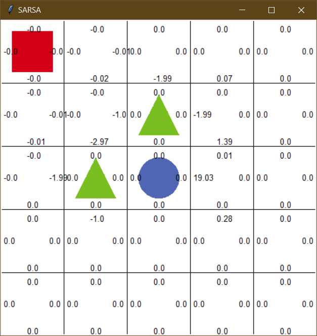
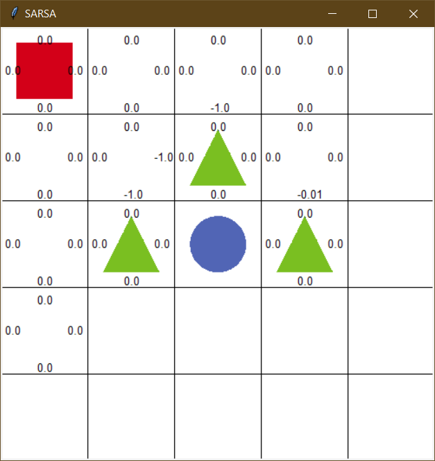
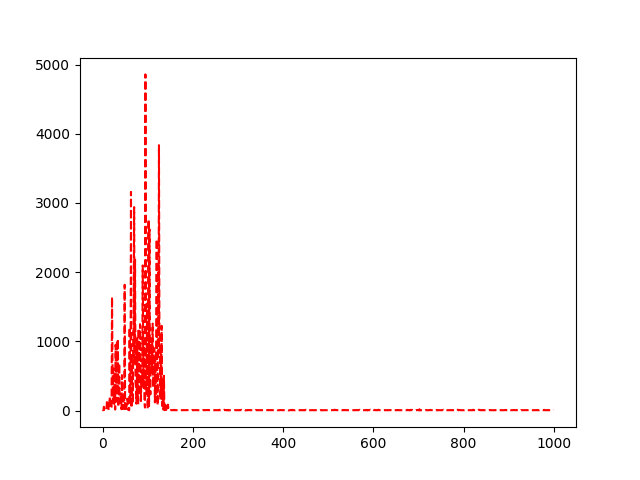

# Grid world with SARSA (State-Action-Reward-State'-Action')

## Set an environment for agent

`sarsa_agent.py ` import environment properties from `environment.py`. This agent program set an agent with action lists as array from environment with:
```python
agent = SARSAgent(actions=list(range(env.n_actions)))
```

## Iterate through definite episodes

Episode is defined as agent's interaction with environment. It will end if agent gets into circle object as a finish, an object with reward `100`, or triangle objects that determined as obstacle with reward `-100`. Agent will save each state and collected reward as sample. 

In the beginning of each episode, the agent will get action of current state, which is starting coordinate `0,0`. Each step that the agent retrieve sample of state, action, reward, next_state, and next action. next action is get from q function table and determined by epsilon greedy policy. If observed random value is below epsilon that we set, it will take a random action and if it doesn't then will take action according to the q function table. It's explanation of below function:

```python
def get_action(self, state):
        if np.random.rand() < self.epsilon:
            # take random action
            action = np.random.choice(self.actions)
        else:
            # take action according to the q function table
            state_action = self.q_table[state]
            action = self.arg_max(state_action)
        return action
```

<p align="center"></p>

We ran 1000 episodes for this experimeent and observed what agent do. In the first 100 episodes the agent is struggling finding a finish. It always get the obstacle rather than finish itself. Many steps is taken by the agent and it explore all grid in environment. Learning process is takes more than an hour when the agent finally get into finish and updating q function table.

## Agent learns through sampled SARS'A'

Mechanic of learning process of visited states are below:

1. Before episode ends, SARSA updating q function that sampled current state, current action, reward, next state, and next action.
2. New q value is calculated by below function:
```python
new_q = (current_q + self.learning_rate * (reward + self.discount_factor * next_state_q - current_q))
```
3. Save new q value into table and it will determined next action
4. Q function table consist of q value that resides in states and what action agent makes.

## Add more obstacle in environment with -1 reward

<p align="center"></p>

This experiment to see how this program will run when introduce one more obstacle near goal. We run the program with 1000 episodes and compare to the environment with just two of obstacles. 

<p align="center"></p>
<p align="center">Two obstacles<p>
<p align="center"></p>
<p align="center">Three obstacles<p>

Surprisingly, the agent in three obstacles environment perform well and take less steps than when it in just two obstacles. The agent take route head bottom rather than going to right side of starting point. When it found finish, it become more aware of shortest path to finish because of value update. But, the agent is struggling when reach into 100 steps. Because of updating after it finish, it knows the bigger value in each step near finish. The agent will keep exploit it until finish all episodes.