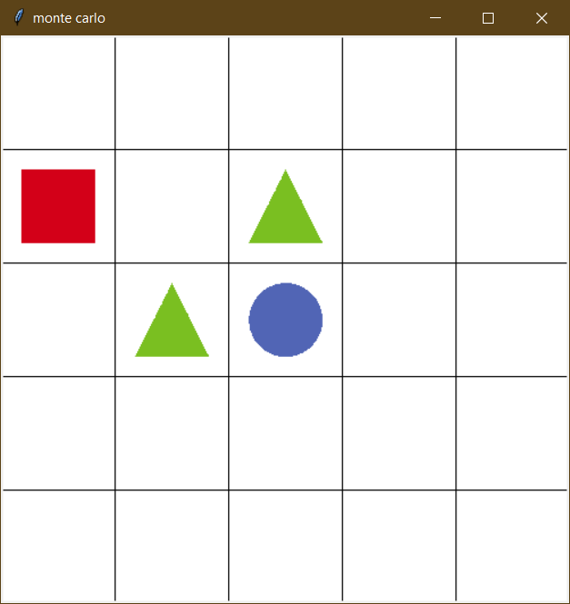
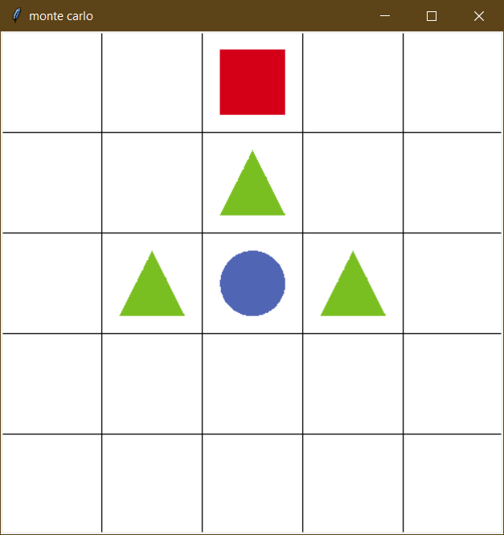
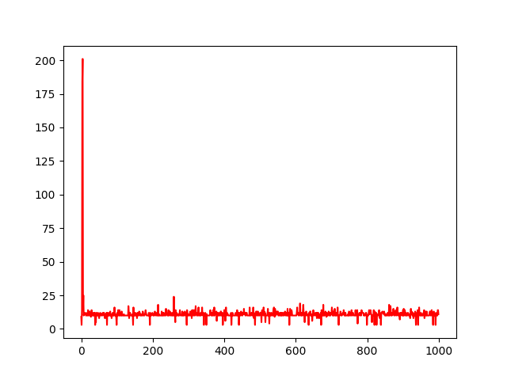

# Grid world with Q Learning

## Set an environment for agent

`sarsa_agent.py ` import environment properties from `environment.py`. This agent program set an agent with action lists as array from environment with:
```python
agent = SARSAgent(actions=list(range(env.n_actions)))
```

## Iterate through definite episodes

Episode is defined as agent's interaction with environment. It will end if agent gets into circle object as a finish, an object with reward `100`, or triangle objects that determined as obstacle with reward `-100`. Agent will save each state and collected reward as sample. 

In the beginning of each episode, the agent will get action of current state, which is starting coordinate `0,0`. Each step that the agent makes 

<p align="center"></p>

In every end of episode, agent will update Q function of visited states. 

## Update Q function of visited states

Mechanic of update Q function of visited states are below:

1. The order of samples will reversed, which means end of state will be in first order of array samples.
2. `G_t` is sum of rewards that the agent has got from exploration of environment.
3. Retrieve current state value from value table
4. Updating value table with `value + learning_rate * (G_t - value)`

## Add more obstacle in environment with -1 reward

<p align="center"></p>

This experiment to see how this program will run when introduce one more obstacle near goal. We run the program with 1000 episodes and compare to the environment with just two of obstacles. 

<p align="center"></p>
<p align="center">Two obstacles<p>
<p align="center"></p>
<p align="center">Three obstacles<p>

Surprisingly, the agent in three obstacles environment perform well and take less steps than when it in just two obstacles. The agent take route head bottom rather than going to right side of starting point. When it found finish, it become more aware of shortest path to finish because of value update. But, the agent is struggling when reach into 100 steps. Because of updating after it finish, it knows the bigger value in each step near finish. The agent will keep exploit it until finish all episodes.