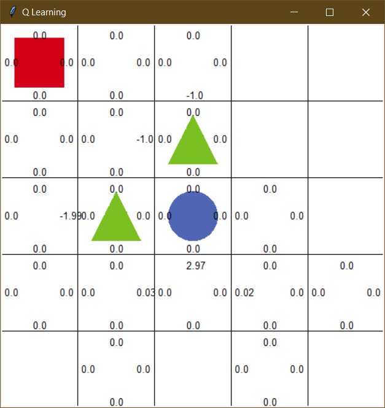
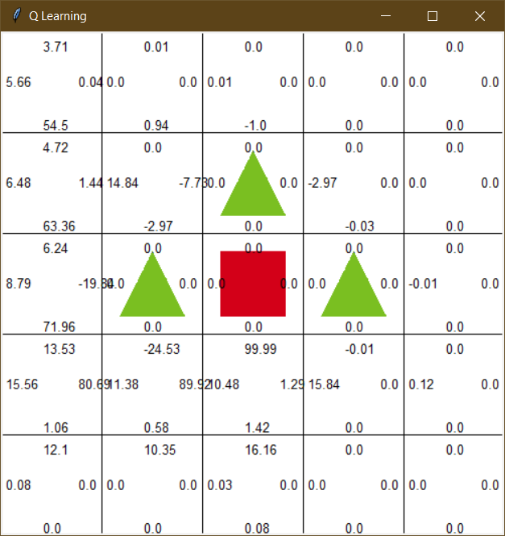
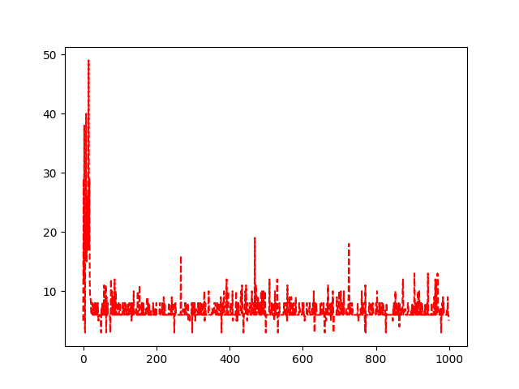
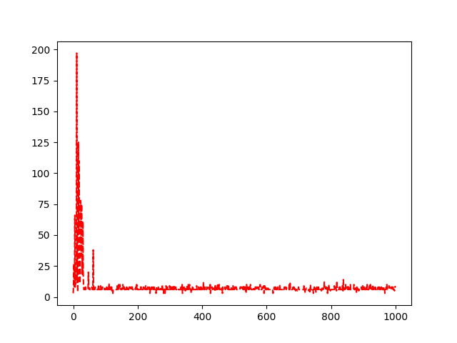

# Grid world with Q Learning

## Set an environment for agent

`sarsa_agent.py ` import environment properties from `environment.py`. This agent program set an agent with action lists as array from environment with:
```python
agent = QLearningAgent(actions=list(range(env.n_actions)))
```

## Iterate through definite episodes

Episode is defined as agent's interaction with environment. It will end if agent gets into circle object as a finish, an object with reward `100`, or triangle objects that determined as obstacle with reward `-100`. Agent will save each state and collected reward as sample. 

In the beginning of each episode, the agent will get action of current state, which is starting coordinate `0,0`. Each step that the agent retrieve sample of state, action, reward, and next_state. Next action is get from q function table and determined by epsilon greedy policy. If observed random value is below epsilon that we set, it will take a random action and if it doesn't then will take action according to the q function table. It's explanation of below function: 

```python
def get_action(self, state):
        if np.random.rand() < self.epsilon:
            # take random action
            action = np.random.choice(self.actions)
        else:
            # take action according to the q function table
            state_action = self.q_table[state]
            action = self.arg_max(state_action)
        return action
```

<p align="center"></p>

We ran 1000 episodes for this experimeent and observed what agent do. In the first 20 episodes the agent struggles to find a finish. But after 21 episodes, the agent finally found a shortest path according to q function table. Compared to SARSA, learning process of Q Learning is lesser with making less steps too.

## Agent updates the Q Function

Mechanic of update Q function of visited states are below:

1. New Q value is calculated using Bellman Optimality Equation with below function:

```python
new_q = reward + self.discount_factor * max(self.q_table[next_state])
```

2. All value sampled each step the agent makes. Sampled values are current state, current action, reward, and next state.
3. New Q value will updated in q function table with below function:

```python
self.q_table[state][action] += self.learning_rate * (new_q - current_q)
```

## Add more obstacle in environment with -1 reward

<p align="center"></p>

This experiment to see how this program will run when introduce one more obstacle near goal. We run the program with 1000 episodes and compare to the environment with just two of obstacles. 

<p align="center"></p>
<p align="center">Two obstacles<p>
<p align="center"></p>
<p align="center">Three obstacles<p>

The agent in three obstacles environment is takes more steps than two obstacles environment. The agents takes up to 200 steps in the first 20 episodes. But the rest of episodes, the agent found a shortest path according to q function table that agent learned. There is no huge difference from different environment after few episodes until final episode. 