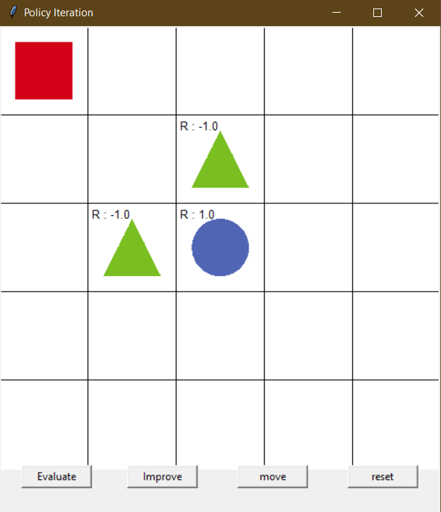
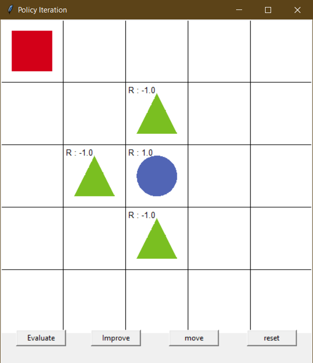

# Report of Reinforcement Learning Experimentation 

>
> *This repository is forked from https://github.com/rlcode/reinforcement-learning*
>-

## Prerequiesites

* Keras==2.0.3
* numpy==1.12.1
* pandas==0.19.2
* matplotlib==2.0.0
* tensorflow==1.12.0
* Pillow==4.1.0
* gym==0.8.1
* h5py==2.7.0
* scikit-image==0.13.0

Before installing these, i suggest to setup a python environment:

```
python -m venv env
```

Activate it:

* Windows

```
env/Scripts/activate
```

* Linux

```
source /path/to/ENV/bin/activate
```

Install all prerequisites:

```
pip install -r requirements.txt
```

## How to run

Run python file related to name of model, e.g grid world with policy iteration:

```
python policy_iteration.py
```

# Explanation of running program

## Grid world with policy iteration

1. First Running - set an environment

<p align="center"></p>

When we running the program for the first time, we will see interface like above image. Reward `1.0` is given to the blue circle as final destination. Two green triangles is placed near blue circle as penalty with given reward `-1.0`. The empty grid will be given reward `0` for initial value.

The  main program loads environment from environment.py and apply policy iteration on that environment. 

2. Policy Evaluation 

Click on button `Evaluate` to update reward for each states. `policy_evaluation` function calculate next value based on policy table with Bellman Expectation Equation. Policy are initialized with `0.25` for all actions. This function will update value that are stored in `value_table`. 

Value calculated with summation of action times reward of every next possible value in all possible actions. Value will be rounded to only `x.xx`.

3. Policy Improvement

`Improve` button will update probability movement of rectangle in grid environment. It's shown with arrows inside of each grid. In every `policy_improvement` run, policy will initialized with `0.0`. For every actions `[reward + (discount factor) * (next state value function)]` will be calculated. Multiple actions will be picked with same max values and probability of action will be stored for next policy.

4. Steps for Converge.

<p align="center"></p>

* Click `Evaluate` to update value each grid
* Click `Improve` to update probability of rectangle actions.
* When converge or rectangle move to blue circle, value near blue circle is `1`. In my observation, this is due to near to finish value will get higher.
* Each grid that lead to goal have value that grater than `0.5`. Rectangle will choose grid that maximum.
* But it's not always the case, if you click `Evaluate` > `Improve` > `Evaluate` x7 > `Improve` you will get value in each grid like this image:

<p align="center"></p>

5. Change Initial Value and Initial Policy Experiment

<p align="center"></p>

This is experiment to observe training process when initial value of value function set to random values and initial policy set to  normalized random values. 

Random value set by numpy random number:

```python
random_value = np.random.rand()
```

Random policy set by numpy random dirichlet:

```python
# return array of random distribution that sum is 1
random_policy = np.random.dirichlet(np.ones(4), size=1)
```

<p align="center"></p>

With this random values in initial value and initial policy there is slight change in training process. In our optimum way to converge, we get less step for `Evaluate` process. We achieve 6 step only for evaluate after improvement. We can see the result of our value from training process in above image.

6. Insert Additional Obstacle Experiment

In this experiment, we insert additional obstacle (triangle) in our grid world. New obstacle will be placed in `3.4` grid or state. The image of our new grid world is like below image:

<p align="center"></p>

Additional obstacle placed on `row 3, column 4` in our grid world environment. This additional obstacle affects to our training process in terms of iteration. For optimal solution of training process, we must running `Evaluate` and `Improve` sequentially 5 times. This is due to limitation of possible path of rectangle in this grid world. While it's possible to have a path going bottom, but the optimum path is with upper path because have a high value.

<p align="center"></p>

We can not use our way like grid world before that not running `Evaluate` and `Improve` sequentially.

## Grid world with value iteration

